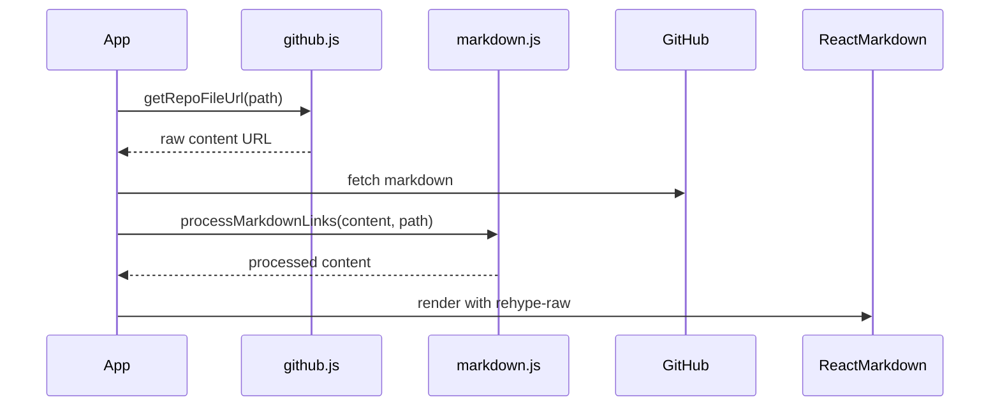

# Markdown Image Link Processing System Design

## Overview
This design describes a system for processing markdown content with embedded images and links, specifically converting relative paths to GitHub raw URLs while maintaining security and proper path resolution.

## File Structure
```
src/
├── utils/
│   ├── github.js          # Path processing and URL generation
│   ├── markdown.js        # Markdown processing utilities
├── App.js                 # Main application with initApp flow
├── config.js              # Configuration repository settings
```

## Key Components

### 1. Markdown File Format
- Standard CommonMark format with optional HTML tags
- Supports both markdown and HTML image syntax:
  ```markdown
  
  
  ```

### 2. Configuration (config.js)
```javascript
export const config = {
  githubaccount: 'your-username',
  repository: 'your-repo',
  docsfolder: 'docs',       // Base content directory
  defaultBranch: 'main',    // GitHub branch
  allowedImageExtensions: ['.png', '.jpg', '.jpeg', '.gif']
};
```

### 3. Modified initApp Flow


## Core Functions

### 1. Path Normalization (github.js)
```javascript
export function normalizePath(inputPath) {
  return inputPath
    .replace(/^\/+|\/+$/g, '')    // Trim slashes
    .replace(/\/+/g, '/')         // Collapse multiple slashes
    .replace(/^(\.\.\/|\.\/)+/g, ''); // Remove relative markers
}
```

### 2. URL Generation (github.js)
```javascript
export async function getContentUrl(relativePath, currentPath) {
  const { githubaccount, repository, docsfolder, defaultBranch } = await config;
  
  const basePath = path.dirname(currentPath);
  const resolvedPath = path.join(basePath, relativePath);
  
  return `https://raw.githubusercontent.com/${githubaccount}/${repository}/${defaultBranch}/${
    docsfolder ? `${docsfolder}/` : ''
  }${normalizePath(resolvedPath)}`;
}
```

### 3. Markdown Processing (markdown.js)
```javascript
export async function processMarkdownLinks(content, currentPath) {
  // Process markdown images
  content = content.replace(
    /!\[([^\]]*)\]\(([^)]+)\)/g, 
    async (match, alt, imgPath) => {
      if (isAbsoluteUrl(imgPath)) return match;
      const url = await getContentUrl(imgPath, currentPath);
      return ``;
    }
  );
  
  // Process HTML images
  content = content.replace(
    /]+src="([^">]+)"[^>]*>/g,
    async (match, imgPath) => {
      if (isAbsoluteUrl(imgPath)) return match;
      const url = await getContentUrl(imgPath, currentPath);
      return match.replace(imgPath, url);
    }
  );
  
  return content;
}
```

## Key Considerations

### Security
- **Path Traversal Protection**: Normalization removes `../` sequences
- **URL Validation**: Only process relative paths
- **Content Sanitization**: When using `rehype-raw`:
  ```javascript
  <ReactMarkdown rehypePlugins={[rehypeRaw, rehypeSanitize]}>
    {content}
  </ReactMarkdown>
  ```

### Performance
- **Caching**: Cache resolved URLs for duplicate image paths
- **Batching**: Process multiple replacements in parallel where possible

### Error Handling
- **Invalid Paths**: Log warnings but continue processing
- **Missing Images**: Fallback to placeholder or original path
- **Rate Limiting**: Handle GitHub API rate limits gracefully

## Integration Points

### Modified initApp
```javascript
export const initApp = async () => {
  // ... existing code ...
  
  const markdownResponse = await axios.get(downloadUrl);
  let content = markdownResponse.data;
  
  // Process image links
  content = await processMarkdownLinks(content, path);
  
  // Render with HTML support
  const markdownSection = (
    <ReactMarkdown rehypePlugins={[rehypeRaw]}>
      {content}
    </ReactMarkdown>
  );
  
  renderedSections.push({
    type: 'markdown',
    content: markdownSection
  });
  
  // ... rest of initApp ...
};
```

## Additional Recommendations

1. **Image Optimization**:
   - Consider using GitHub's CDN or a proxy for image optimization
   - Implement lazy loading for better performance

2. **Link Validation**:
   - Verify existence of linked resources during development
   - Provide broken link warnings

3. **Local Development**:
   - Support local file paths during development
   - Environment-specific URL generation

4. **Accessibility**:
   - Ensure all generated images have proper alt text
   - Validate color contrast for text-over-image scenarios

This design provides a robust solution for handling markdown content with embedded images while maintaining security and proper path resolution in a GitHub-based content system.